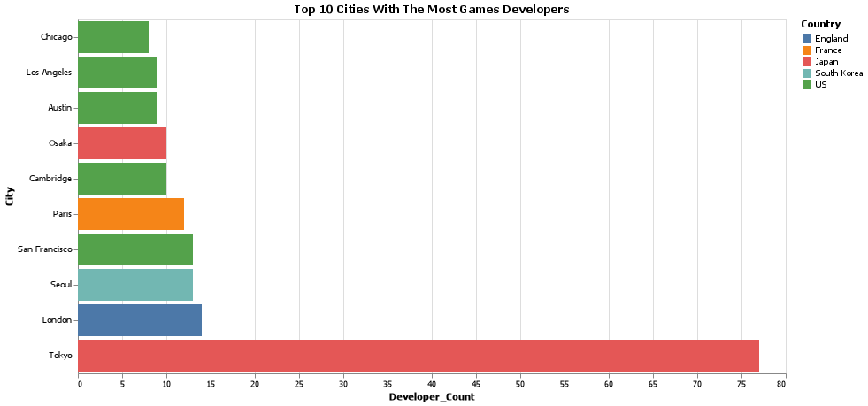
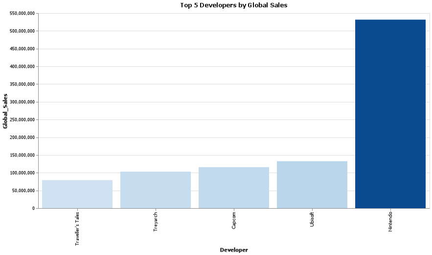
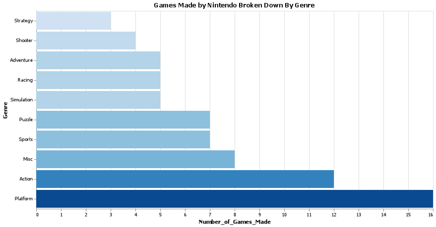
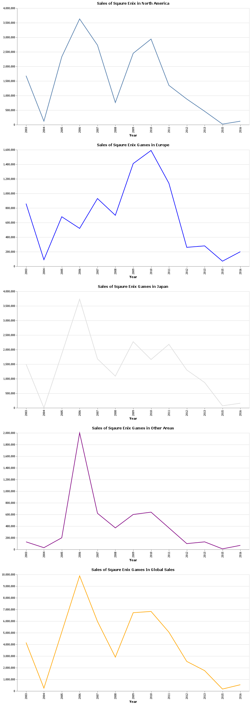

# Game Developers Analysis

__Joseph Davis__


## Project Summary

_This project is meant to demonsrate the use of SQL querying and data visualization skills using the Altair library in Python. This analysis will review different game developers throughout the world and provide insights regarding sales amounts, locations of the developers, and genres of games made._

_The layout of the analysis will include a question or objective being stated followed by four components:_
1. The SQL query used to obtain the information.
2. A table representing the data pulled from the SQL query.
3. A visualization to help explain and understand the data (below the visualization will be the code used to create it).
4. Insights regarding the stated question or objective.


#### Question 1: Find the top 10 Cities with the most amount of game developers.

```
SELECT DISTINCT city AS City, country AS Country, COUNT(developer) as Developer_Count
FROM developper 
GROUP BY city
ORDER BY COUNT(developer) DESC
LIMIT 10

```


| City          | Country     |   Developer_Count |
|:--------------|:------------|------------------:|
| Tokyo         | Japan       |                77 |
| London        | England     |                14 |
| San Francisco | US          |                13 |
| Seoul         | South Korea |                13 |
| Paris         | France      |                12 |
| Osaka         | Japan       |                10 |
| Cambridge     | US          |                10 |
| Austin        | US          |                 9 |
| Los Angeles   | US          |                 9 |
| Vancouver     | Canada      |                 8 |




```
q1_chart = (alt.Chart(q1.dataframe, title = "Top 10 Cities With The Most Games Developers")
.mark_bar()
.encode(
    color = alt.Color('Country'),
    x = alt.X('Developer_Count'),
    y = alt.Y('City', sort=alt.EncodingSortField(field='Developer_Count', order='ascending', op='sum'))    
)
.properties(
    width = 800,
    height = 400
))

q1_text = q1_chart.mark_text(
    align='left',
    baseline='middle',
    dx = 3
).encode(
    text='Developer_Count'
)
```
- From our visualizations we can see how dominant the city of Japan is. Over 75 developers were locate there at the time this data was taken. The next highest city was london with 14 devlepers. We can also see that while the US did not have a top 3 city in developer counts, it did have 4 cities in total within the top 10 cities. This leads to an overall developer count of 40 developers for cities located within the US.
 

 <p>&nbsp;</p>

#### Question 2: Who are the Top 5 devleopers with the highest amount of sales (global Sales)?

```
SELECT d.developer AS Developer, sum(v.global_sales)*1000000 AS Global_Sales
FROM vgsales v
JOIN developper d
ON  v.developer = d.developer
GROUP BY d.developer
ORDER BY Global_Sales DESC
LIMIT 5
```

| Developer         |   Global_Sales |
|:------------------|---------------:|
| Nintendo          |      531710000 |
| Ubisoft           |      132540000 |
| Capcom            |      115710000 |
| Treyarch          |      103160000 |
| Traveller's Tales |       79220000 |




```
q2_chart = (alt.Chart(q2.dataframe, title = "Top 5 Developers by Global Sales")
.mark_bar()
.encode(
    x= alt.X('Developer', sort='y'),
    y= alt.Y('Global_Sales'),
    color = alt.Color('Global_Sales', legend = None))
.properties(
    width = 800,
    height = 400
))
```

- Nintendo is by far the most successful game developer with over have a billion global sales. Nintendo is also one of the older game developers being founded back in 1889 (nintendo.com).


<p>&nbsp;</p>

####  Question 3: Breakdown the amount of games Nintendo has developed by Genre.

```
SELECT genre AS Genre, COUNT(GENRE) AS Number_of_Games_Made
FROM vgsales
WHERE developer = "Nintendo"
GROUP BY genre
ORDER BY COUNT(GENRE) ASC
```

| Genre      |   Number_of_Games_Made |
|:-----------|-----------------------:|
| Strategy   |                      3 |
| Shooter    |                      4 |
| Adventure  |                      5 |
| Racing     |                      5 |
| Simulation |                      5 |
| Sports     |                      7 |
| Puzzle     |                      7 |
| Misc       |                      8 |
| Action     |                     12 |
| Platform   |                     16 |




```
q3_chart = (alt.Chart(q3.dataframe, title = "Games Made by Nintendo Broken Down By Genre")
.mark_bar()
.encode(
    x="Number_of_Games_Made",
    y= alt.Y('Genre', sort = 'x'),
    color = alt.Color('Number_of_Games_Made', legend = None))
.properties(
    width = 800,
    height = 400
))
```
- Nintendo has a large variety of game genres. However we can see that Platofrm and Acton games comprise the majority of their games. 

<p>&nbsp;</p>

#### Question 4: Find out the sales of the developer "Square Enix" break down the sales by each region.

```
SELECT year_of_release as Year,
    SUM(na_sales)*1000000 AS North_America_Sales,
    SUM(eu_sales)*1000000 AS Europe_Sales ,
    SUM(jp_sales)*1000000 AS Japan_Sales,
    SUM(other_sales)*1000000 AS Other_Sales,
    SUM(global_sales)*1000000 AS Global_Sales 
FROM vgsales
WHERE developer = "Square Enix" and year_of_release IS NOT NULL
GROUP BY year_of_release
ORDER BY year_of_release
```

|   Year |   North_America_Sales |   Europe_Sales |   Japan_Sales |   Other_Sales |   Global_Sales |
|-------:|----------------------:|---------------:|--------------:|--------------:|---------------:|
|   2003 |               1680000 |         860000 |       1500000 |        130000 |        4160000 |
|   2004 |                120000 |          90000 |             0 |         30000 |         250000 |
|   2005 |               2330000 |         680000 |       1850000 |        200000 |        5060000 |
|   2006 |               3630000 |         520000 |       3730000 |       2000000 |        9880000 |
|   2007 |               2730000 |         930000 |       1680000 |        620000 |        5970000 |
|   2008 |                760000 |         700000 |       1090000 |        370000 |        2910000 |
|   2009 |               2450000 |        1410000 |       2270000 |        600000 |        6720000 |
|   2010 |               2940000 |        1590000 |       1660000 |        640000 |        6830000 |
|   2011 |               1350000 |        1140000 |       2180000 |        370000 |        5050000 |
|   2012 |                880000 |         260000 |       1300000 |        100000 |        2540000 |
|   2013 |                460000 |         280000 |        870000 |        130000 |        1750000 |
|   2015 |                 20000 |          70000 |         70000 |         10000 |         170000 |
|   2016 |                120000 |         200000 |        160000 |         70000 |         540000 |




```
q4_chart_na = (alt.Chart(q4.dataframe, title = "Sales of Sqaure Enix in North America")
.mark_line(line = True)
.encode(
    x=alt.X('Year:O'),
    y=alt.Y('North_America_Sales', title=""))
.properties(
    width = 800,
    height = 400
))

q4_chart_eu = (alt.Chart(q4.dataframe, title = "Sales of Sqaure Enix Games in Europe")
.mark_line(line = True, color='blue')
.encode(
    x=alt.X('Year:O'),
    y=alt.Y('Europe_Sales', title=""))
.properties(
    width = 800,
    height = 400
))

q4_chart_jp = (alt.Chart(q4.dataframe, title = "Sales of Sqaure Enix Games in Japan")
.mark_line(line = True, color='geen')
.encode(
    x=alt.X('Year:O'),
    y=alt.Y('Japan_Sales', title=""))
.properties(
    width = 800,
    height = 400
))

q4_chart_other = (alt.Chart(q4.dataframe, title = "Sales of Sqaure Enix Games in Other Areas")
.mark_line(line = True, color='purple')
.encode(
    x=alt.X('Year:O'),
    y=alt.Y('Other_Sales', title=""))
.properties(
    width = 800,
    height = 400
))

q4_chart_global = (alt.Chart(q4.dataframe, title = "Sales of Sqaure Enix Games In Global Sales")
.mark_line(line = True, color='orange')
.encode(
    x=alt.X('Year:O'),
    y=alt.Y('Global_Sales', title=""))
.properties(
    width = 800,
    height = 400
))
```

- Lookng over this data we can see that most areas followed the same pattern. In 2006 there was a large spike in sales for Square Enix, the one exception to this took place in Europe where 2006 still saw an increase but at a much smaller scale.

- Another sales increase was shown around the 2010 mark, this was shown in all geographic areas.

- The last trend ovserved was the decrease in sales starting around 2011 and continuing until 2015, it does look like in the year 2016 sales started to trend upward. This could be due to a lack of released games during this - time.
